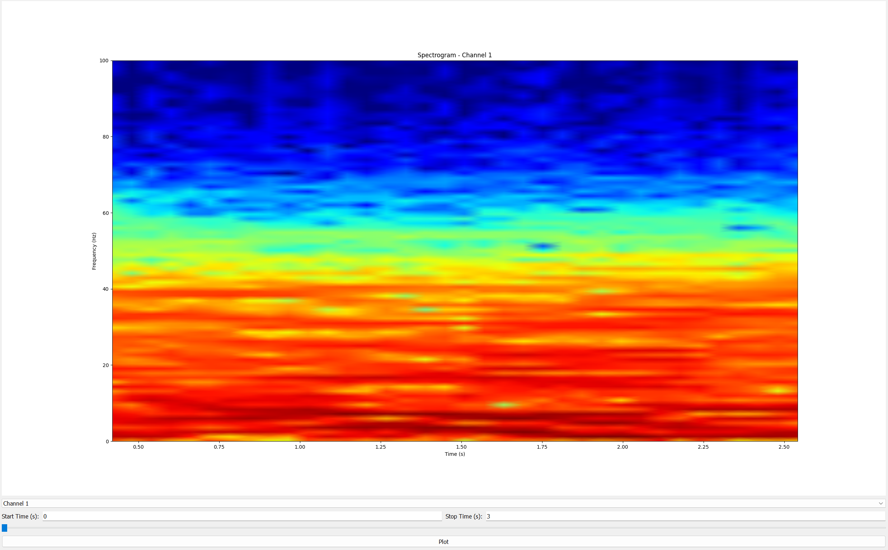
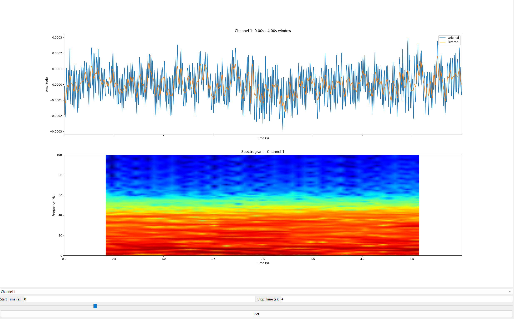
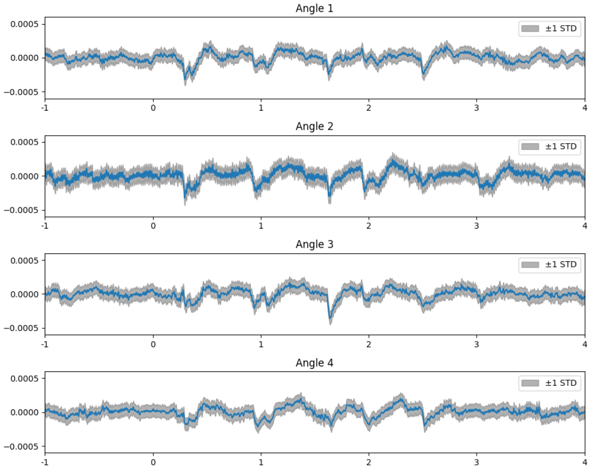
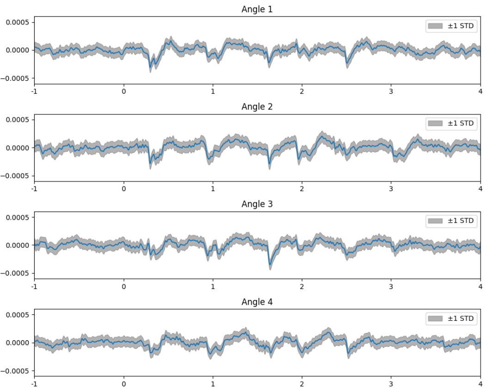
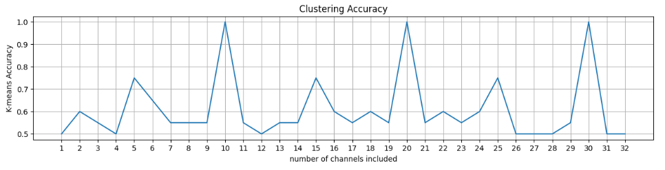
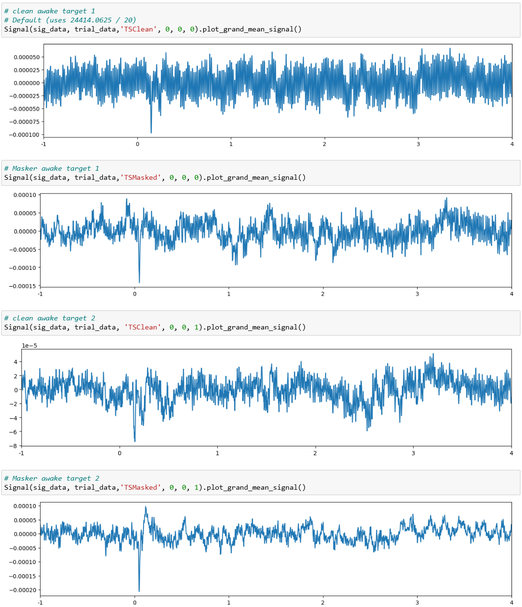
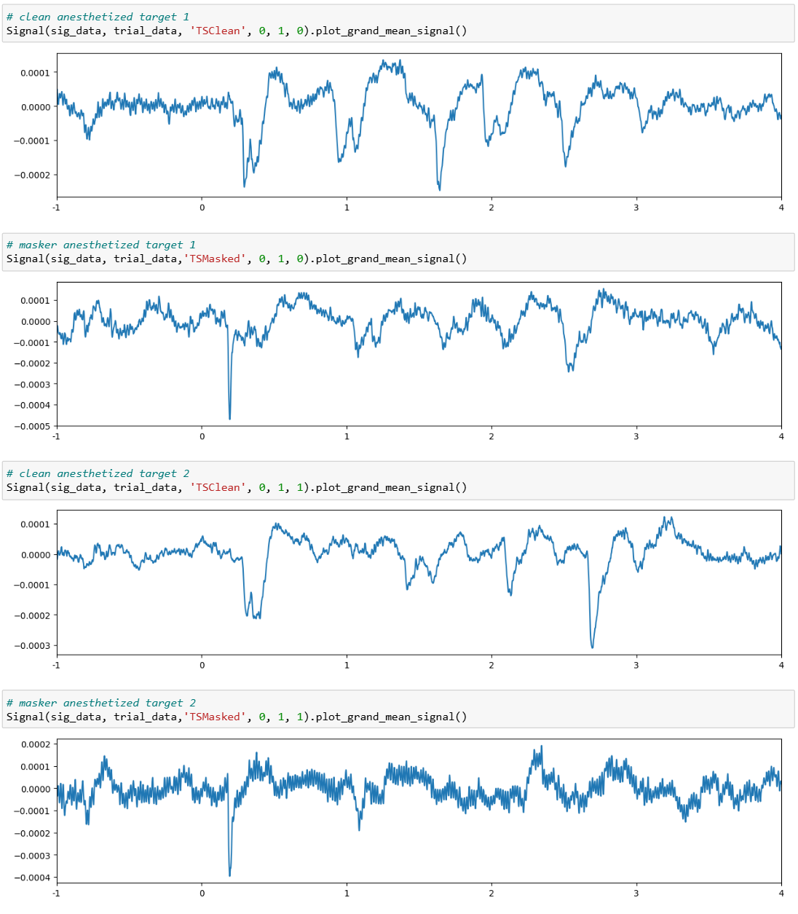

# Project Scope
This repository contains Jupyter notebooks for processing and analyzing electrophysiological data collected from mice during behavioral task. During the task, the mice was either awake or anesthetized and the sound could be played from four different locations. The analysis primarily focuses on Local Field Potential (LFP) and Multi-Unit Activity (MUA) signals. Techniques include spectrogram generation, denoising, dimensionality reduction (PCA), and clustering (KMeans).

The goal is to extract meaningful neural representations from raw LFP and MUA signals using time-frequency and statistical methods. The analysis supports behavioral neuroscience experiments aiming to understand sensory processing and neural dynamics.

## Repository Contents

### The Analysis of Local Field Potential 
`Spectrogram_Denoised_Signal.ipynb`
 
The LFP from Mouse 622 is a Numpy Array with the shape of (4968346, 32). 32 indicates there are 32 channels. Signal in each channel is processed with a 60Hz notch filter, a low-pass filter with a cutoff frequency of 40Hz and then a Savitzky–Golay filter to denoise and smooth the signal. In the end, a spectrogram GUI is built with a dropdown menu for selecting channels, boxes for resetting time window and a slider for adjusting the time window. 

**Fig. 1** | Spectrogram GUI displaying the LFP signals from Mouse 622
    
`(Unfilter & Filtered)LFP & Spectrogram.ipynb`
 
The upper panel displays both the original signal for the selected channel and the signal which is denoised and smoothed. The lower panel shows the spectrogram of the denoised signal.  

**Fig. 2** | GUI displaying the original and denoised signals, along with the spectrogram of the denoised signal from Mouse 622
    

`Epoch_based_on_four_angle&PCA.ipynb`
 
The local field potentials from Mouse 622 were epoched and averaged while the mouse was anesthetized under clean background conditions, relative to four different angles from which the Target 1 cue was presented.

**Fig. 3** | Epoched local field potentials (LFPs) corresponding to four different sound source locations
  
The denoised local field potentials from Mouse 622 were epoched and averaged while the mouse was anesthetized under clean background conditions, relative to four different angles from which the Target 1 cue was presented.

**Fig. 4** | Denoised epoched local field potentials (LFPs) corresponding to four different sound source locations
   

`PCA_and_KMeans.ipynb`
 
When Mouse 622 was anesthetized under clean background conditions and target 1 was presented. Principal Component Analysis (PCA) was empolyed to reduce the dimensionality of the extracted features and to differentiate the LFPs corresponding to Angle 1 and LFPs of Angle 4. Classification accuracy was estimated using K-means clustering as more channels were counted. For each angle, each channel contains ten epochs. As more channels counted, the shape of data matrix from either angle 1 or angle 4 is always in the form of `ℝⁿˢᵃᵐᵖˡᵉˢ × mᶠᵉᵃᵗᵘʳᵉˢ`

To quantify differences between signals, additional channels were incorporated to enrich the feature representation, while the sample size was held constant at 
n=10 to ensure consistency. If you change the number of samples, you're not just comparing signal content — you're also comparing dataset size, which introduces confounds.

**Fig. 5** | K-means classification accuracy as a function of the number of channels included
   

`Organized_Trialinfo_Analysis.ipynb`
 
The difference in LFPs between awake and anesthetized states arises from the fundamental changes in brain dynamics and neuronal activity under anesthesia.

**Anesthetized**: Brain activity becomes more synchronized, especially in low-frequency bands such as delta and theta. This leads to larger amplitude, slower LFP oscillations—clearly visible in the anesthetized plots. Under anesthesia, cortical circuits shift into an up-down state or burst-suppression mode, creating strong, regular fluctuations in membrane potentials and therefore stronger LFP patterns. Furthermore, anesthesia tends to improve signal-to-noise ratio for evoked responses because spontaneous activity is suppressed.

**Awake**: Neural activity is more desynchronized, with higher-frequency, lower-amplitude fluctuations. That's why awake LFPs look “noisier” or more broadband and with smaller deflections. Awake animals are constantly processing sensory input, leading to continuous, irregular synaptic activity. Awake LFPs contain more spontaneous activity, making it harder to isolate evoked features.

**Fig. 6** | Plots of Mouse 622's LFPs when the mouse was awake under clean background conditions with Target 1 presented
   

**Fig. 7** | Plots of Mouse 622's LFPs when the mouse was anesthetized under clean background conditions with Target 1 presented

### The Analysis of Multi-Unit Activity 

## License

This project is licensed under the MIT License - see the [LICENSE](LICENSE) file for details.